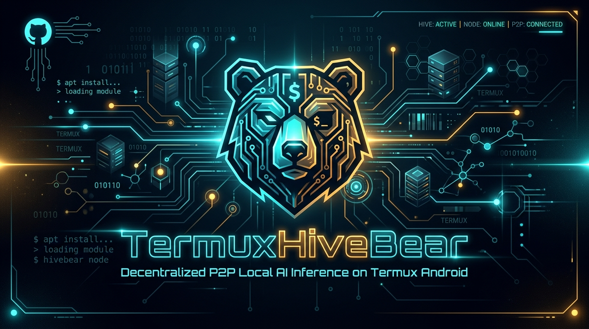

# 🐻 TermuxHiveBear

> **Decentralized P2P Local AI Inference on Termux Android**  
> *Inferencia de IA Local y Descentralizada P2P en Termux Android*

[](https://github.com/BeckhamLabsLLC/HiveBear)
[](https://github.com/termux/termux-app)
[](https://github.com/kuromi04/TermuxHiveBear)
[](LICENSE)

---

## ⚡ 1-Line Automatic Installer / Instalador Automático en 1 Línea

Run this single command in Termux to install everything automatically:  
*Ejecuta este único comando en Termux para instalar todo automáticamente:*

```bash
git clone https://github.com/kuromi04/TermuxHiveBear.git && cd TermuxHiveBear && bash install.sh
```

### 🚀 Usage after installation / Uso tras la instalación
Once installed, simply type **`termuxhivebear`** anytime from any directory to open the interactive CLI menu:  
*Una vez instalado, simplemente escribe **`termuxhivebear`** desde cualquier carpeta para abrir el menú interactivo:*

```bash
termuxhivebear
```

---

## 🌐 Languages / Idiomas

- [English Documentation](#-english-documentation)
- [Documentación en Español](#-documentación-en-español)

---

## 🇬🇧 English Documentation

### 📌 About The Project
**TermuxHiveBear** is a specialized port and deployment guide for running [HiveBear](https://github.com/BeckhamLabsLLC/HiveBear) (by Beckham Labs LLC) natively inside **Termux** on Android devices. HiveBear enables decentralized peer-to-peer (P2P) mesh local LLM inference across devices, running fast GGUF models on ARM64 architectures using `llama.cpp` and Rust.

### 📲 Termux Installation Recommendation
> ⚠️ **IMPORTANT:** Always install Termux from its official **GitHub Releases** repository. **DO NOT** use the outdated Google Play Store version as its repositories are deprecated.

* Download latest APK from GitHub: [termux/termux-app Releases](https://github.com/termux/termux-app/releases)

### ✨ Features
* 🚀 **100% Offline & Private:** Run LLMs locally on Android without sending data to external cloud servers.
* ⚡ **Optimized for Mobile Hardware:** Light RAM footprint (~400MB - 1GB) with high performance (20-40+ tokens/sec).
* 🔒 **QUIC + TLS 1.3 Encryption:** Secure P2P networking and mesh node inter-communication.
* 🌐 **OpenAI / Ollama Compatible API:** Built-in API server (`hivebear serve`) to integrate with local apps.

### 🛠️ Termux Setup & Execution Commands

#### 1. Prepare Environment & Install Dependencies
Open Termux and run:
```bash
pkg update && pkg install git curl -y
```

#### 2. Create Model Directory & Download GGUF Weights
Due to HuggingFace API constraints on mobile shells, manual model downloading is recommended:
```bash
mkdir -p ~/.cache/hivebear/models
curl -L -o ~/.cache/hivebear/models/qwen2.5-0.5b-instruct-q4_k_m.gguf \
  https://huggingface.co/Qwen/Qwen2.5-0.5B-Instruct-GGUF/resolve/main/qwen2.5-0.5b-instruct-q4_k_m.gguf
```

#### 3. Run HiveBear Local Inference
```bash
hivebear run ~/.cache/hivebear/models/qwen2.5-0.5b-instruct-q4_k_m.gguf
```

#### 4. Run API Server Mode (OpenAI / Ollama Endpoint)
```bash
hivebear serve
```

### 🛰️ Available Commands Reference

| Command | Description |
|---|---|
| `termuxhivebear` | Open interactive CLI menu |
| `hivebear run <model_path>` | Run interactive chat with a local `.gguf` model |
| `hivebear serve` | Start an OpenAI & Ollama compatible local API server |
| `hivebear recommend` | Show hardware profile and recommended models |
| `hivebear share` | Share local model via public/local web link |
| `hivebear mesh` | Manage P2P distributed inference mesh |

---

## 🇪🇸 Documentación en Español

### 📌 Acerca del Proyecto
**TermuxHiveBear** es una adaptación y guía de despliegue especializada para ejecutar [HiveBear](https://github.com/BeckhamLabsLLC/HiveBear) (de Beckham Labs LLC) de manera nativa dentro de **Termux** en dispositivos Android. HiveBear permite la inferencia descentralizada P2P de modelos de lenguaje (LLM) entre dispositivos, ejecutando modelos GGUF ultrarrápidos en arquitecturas ARM64 con `llama.cpp` y Rust.

### 📲 Recomendación de Instalación de Termux
> ⚠️ **IMPORTANTE:** Descarga e instala siempre la aplicación Termux desde su repositorio oficial en **GitHub Releases**. **NO** utilices la versión obsoleta de Google Play Store, ya que sus repositorios están deprecados.

* Descargar el APK oficial desde GitHub: [termux/termux-app Releases](https://github.com/termux/termux-app/releases)

### ✨ Características Principales
* 🚀 **100% Privado y Offline:** Ejecuta modelos de inteligencia artificial en tu teléfono sin enviar datos a servidores externos.
* ⚡ **Optimizado para Móviles:** Bajo consumo de RAM (~400MB - 1GB) con alta velocidad de respuesta (20-40+ tokens/seg).
* 🔒 **Cifrado QUIC + TLS 1.3:** Protocolos de red seguros para la malla P2P entre nodos.
* 🌐 **API Compatible con OpenAI / Ollama:** Servidor de API integrado (`hivebear serve`) para conectar con otras apps.

### 🛠️ Comandos de Configuración y Ejecución en Termux

#### 1. Preparar el Entorno e Instalar Dependencias
Abre Termux y ejecuta:
```bash
pkg update && pkg install git curl -y
```

#### 2. Crear Directorio de Modelos y Descargar Pesos GGUF
Para garantizar la compatibilidad en Termux, se recomienda descargar el modelo manualmente:
```bash
mkdir -p ~/.cache/hivebear/models
curl -L -o ~/.cache/hivebear/models/qwen2.5-0.5b-instruct-q4_k_m.gguf \
  https://huggingface.co/Qwen/Qwen2.5-0.5B-Instruct-GGUF/resolve/main/qwen2.5-0.5b-instruct-q4_k_m.gguf
```

#### 3. Ejecutar Inferencia Local con HiveBear
```bash
hivebear run ~/.cache/hivebear/models/qwen2.5-0.5b-instruct-q4_k_m.gguf
```

#### 4. Modo Servidor de API (Endpoint OpenAI / Ollama)
```bash
hivebear serve
```

### 🛰️ Referencia de Comandos

| Comando | Descripción |
|---|---|
| `termuxhivebear` | Abre el menú interactivo por CLI |
| `hivebear run <ruta_modelo>` | Inicia el chat interactivo con el modelo `.gguf` |
| `hivebear serve` | Inicia el servidor de API compatible con OpenAI / Ollama |
| `hivebear recommend` | Muestra el perfil de hardware y modelos recomendados |
| `hivebear share` | Comparte el modelo a través de un enlace web local/público |
| `hivebear mesh` | Administra la red P2P distribuida |

---

## 🤝 Acknowledgments & Special Thanks / Agradecimientos Especiales

- **Original Project:** Created by **[Beckham Labs LLC - HiveBear](https://github.com/BeckhamLabsLLC/HiveBear)**.
- **Special Thanks / Agradecimiento Especial:** Agradecimiento muy especial a **[Ivam3 / Ivam3byCinderella](https://github.com/ivam3)** por su increíble ecosistema **i-HakLab** y su skill **`termux-oracle`**, fundamental para la optimización de Android, Bionic, glibc y el diagnóstico de entornos en Termux.
- **Android Port & Maintainer:** **[kuromi04](https://github.com/kuromi04/TermuxHiveBear)**.
